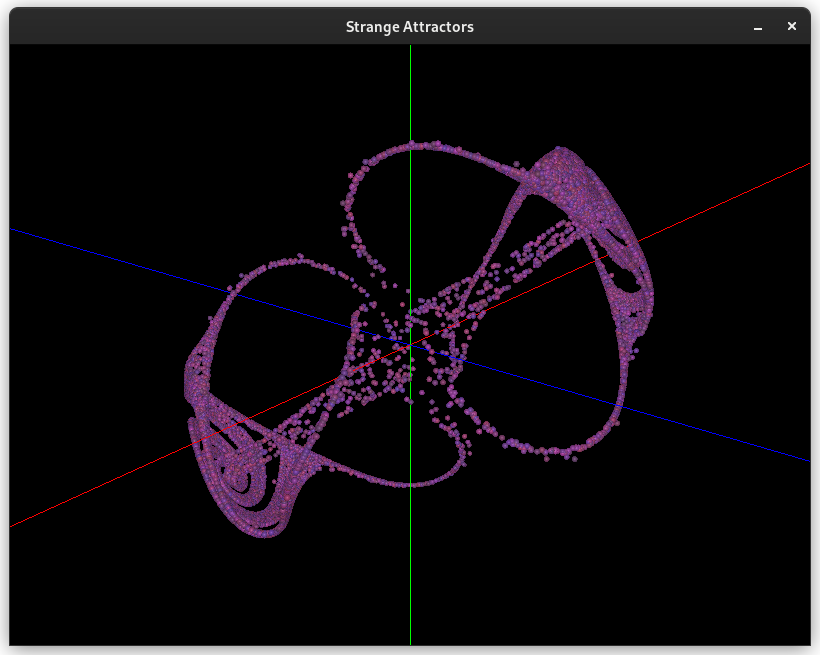

# Strange Attractors
#### Author: Hayden McAlister

This is a small project to explore some dynamic systems and visualize some strange attractors. The project uses Rust with [kiss3d](https://docs.rs/kiss3d/latest/kiss3d/index.html) as a graphics backend. The actual simulations are very crude, we could pretend to be fancy and call this a [Newton-Raphson](https://en.wikipedia.org/wiki/Newton%27s_method) implementation of solving a system of differential equations - but a fairer description is taking little steps in space according to the equation rules. With small enough steps, we get a decent simulation!



## Running the project

Ensure you have compiled the project in *release* mode. Use `cargo build -r` to do this. Kiss3d does not handle large number of points well in debug mode, so `cargo run` is not a great experience.

Once you have compiled the project, run it using the binary `target/release/strange_attractors`. Use the `--help` flag for extended help on the command line arguments to the program, although a summary is left below:

```
Usage: strange_attractors [OPTIONS]

Options:
  -n, --num-points <NUM_POINTS>
          Number of spheres to add to the simulation
          
          [default: 5000]

  -i, --initial-position-scale <INITIAL_POSITION_SCALE>
          Starting random position scale for simulation points.
          
          A larger scale will result in more chaotic behavior sooner
          
          [default: 1]

  -s, --system <SYSTEM>
          The system of equations to simulate. Use  the --help flag to see options.
          
          Options include:
          
          * 0: Lorentz 
          * 1: Aizawa 
          * 2: Thomas Cyclical
          
          [default: 0]

  -h, --help
          Print help (see a summary with '-h')

  -V, --version
          Print version
```